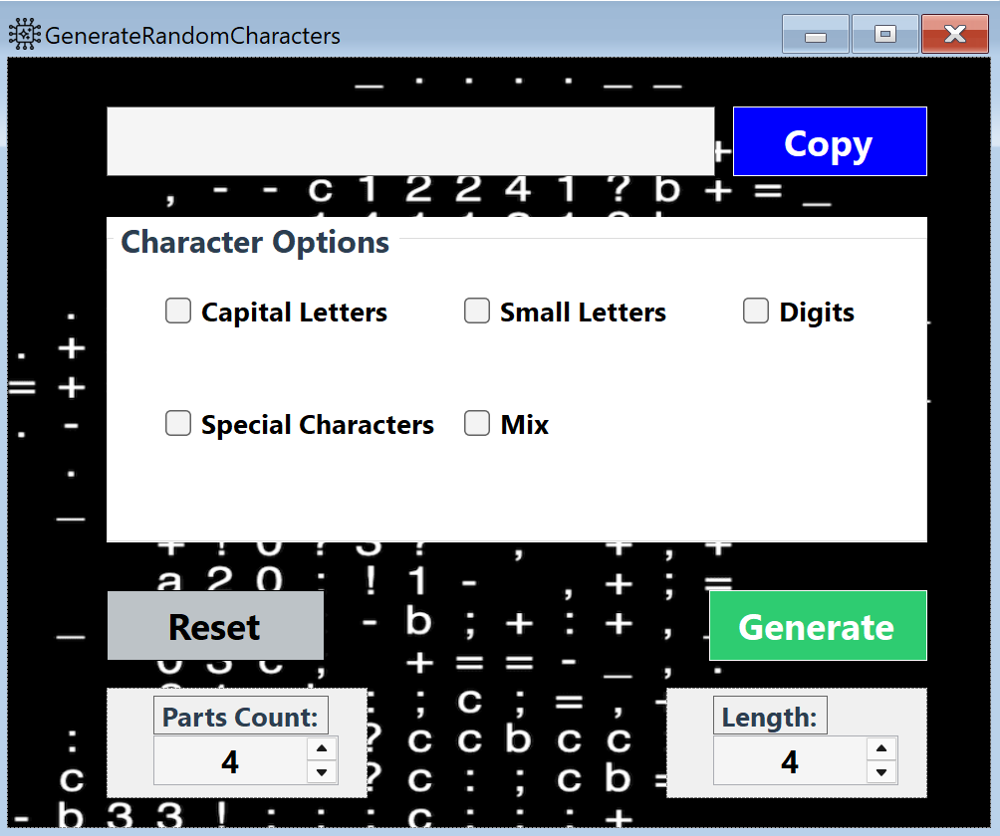
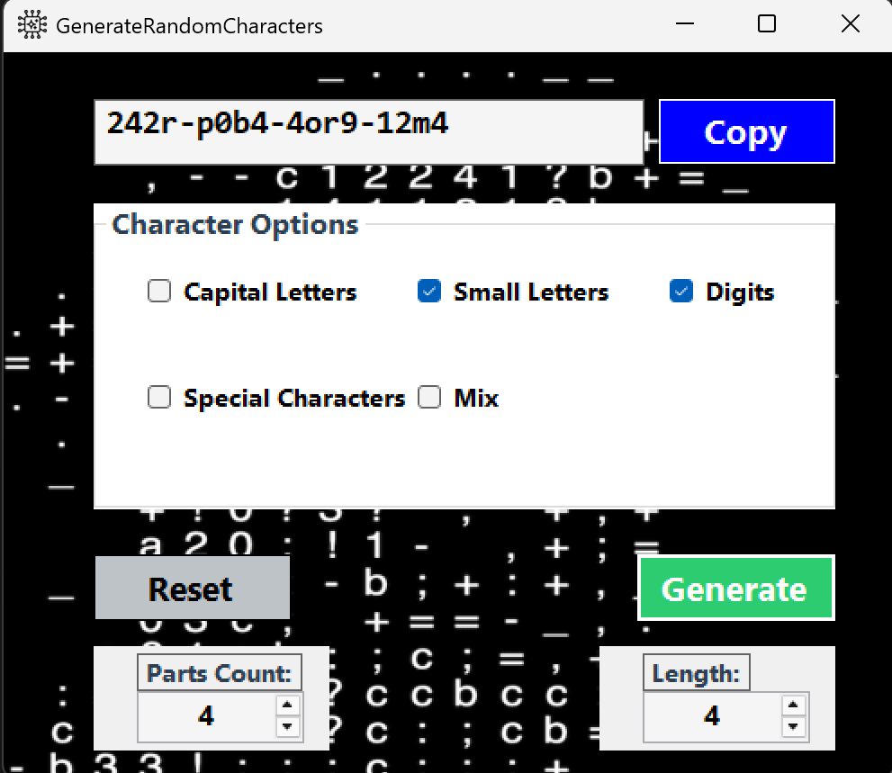

# 🔐 Generate Random Characters (Key Generator)

A simple and clean **Windows Forms (.NET Framework)** application that generates random keys composed of multiple parts separated by hyphens.
The user can fully control **character types**, **number of parts**, **length of each part**, and easily **copy, reset, and navigate previously generated keys**.

---

## 🎥 Demo Video

Watch the application in action on YouTube:

👉 **YouTube Demo:**

```
https://youtu.be/Gx22REjdgYU
```

---

## 🖼 Screenshots

### Main Interface



### Generated Key Example



---

## ✨ Features

* Generate random keys in the format:

  ```
  XXXX-XXXX-XXXX-XXXX
  ```

* Fully configurable key structure:

  * **Number of parts**
  * **Characters per part**

* Choose character types:

  * Small letters (a–z)
  * Capital letters (A–Z)
  * Digits (0–9)
  * Special characters
  * Mix (all types combined)

* Clipboard history (up to **20** generated keys)

* Navigate key history using **↑ / ↓ arrow keys**

* Copy, delete, select all, and reset functionality

* Improved user experience (auto focus & select after copy)

* Clean, readable, and maintainable code structure

---

## 🧠 How It Works

### Character Types

The application defines supported character types using an enum:

```csharp
enum enCharType
{
    SmallLetter = 1,
    CapitalLetter = 2,
    SpecialCharacter = 3,
    Digit = 4,
    Mix = 5
};
```

> **Note:**
> The `Mix` option is handled at the UI logic level.
> When selected, it internally expands to **all supported character types** instead of being used directly during character generation.

---

### Behavior Rules

* When **Mix** is selected:

  * All other character options are disabled automatically
  * Internally expands to:

    * Small letters
    * Capital letters
    * Digits
    * Special characters
  * Characters are generated randomly from all these types

* When **Mix** is not selected:

  * Any combination of character types is allowed
  * Validation ensures at least one type is selected

---

## 🔑 Key Generation Logic

* Each key consists of **multiple parts**, defined by the user.
* The **number of parts** is controlled using a numeric input (`nudPartsCount`).
* The **length of each part** is controlled using a numeric input (`nudLength`).
* Random characters are generated using ASCII ranges.
* A static `Random` instance ensures better randomness.

---

### Parts Count & Length Control

The final key structure follows this format:

```
[Length chars] - [Length chars] - ... (repeated Parts Count times)
```

#### Example

* Parts Count = **4**
* Characters Per Part = **5**

Result:

```
A9d$Q-xP7!R-K2mQa-8@ZfP
```

```
XXXXX-XXXXX-XXXXX-XXXXX
```

---

## 📋 Clipboard History

* Stores up to **20 generated keys**
* Duplicate keys are ignored
* Keyboard navigation:

  * **↑ Arrow** → Previous generated key
  * **↓ Arrow** → Next generated key

---

## 🧩 Main Methods Overview

| Method                              | Description                                    |
| ----------------------------------- | ---------------------------------------------- |
| `Generate()`                        | Validates user input and starts key generation |
| `GenerateKey()`                     | Builds a full key from multiple parts          |
| `GenerateWord()`                    | Generates a random word                        |
| `GetRandomCharacter()`              | Returns a random character                     |
| `GetSelectedTypes()`                | Reads selected character types from UI         |
| `AddToClipboardHistory()`           | Stores generated keys (max 20)                 |
| `UpdateCharacterTypeOptionsState()` | Enables/disables options when Mix is selected  |
| `Copy()`                            | Copies and selects the generated key           |
| `Reset()`                           | Resets UI to default state                     |

---

## ♻ Reset Behavior

When reset is triggered:

* Characters per part is reset to **4**
* Output textbox is cleared
* All character type checkboxes are unchecked
* Disabled options are re-enabled automatically

---

## 🛠 Technologies Used

* **C#**
* **.NET Framework**
* **Windows Forms (WinForms)**
* `StringBuilder` for efficient string construction

---

## 📌 Notes

This project follows **clean code principles** with:

* Clear separation of responsibilities
* Readable and maintainable logic
* Proper validation and UX considerations

Suitable for:

* Learning and practice projects
* Desktop utilities
* Portfolio and GitHub demonstrations

---

## 👤 Author & Links

Developed as a **learning and practice project** using **C# and Windows Forms**.

🔗 **LinkedIn:**
[https://www.linkedin.com/in/khalidamri/](https://www.linkedin.com/in/khalidamri/)

💻 **GitHub:**
[https://github.com/KhalidSyntax](https://github.com/KhalidSyntax)

---